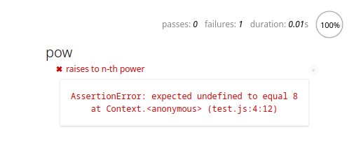
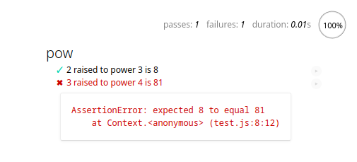
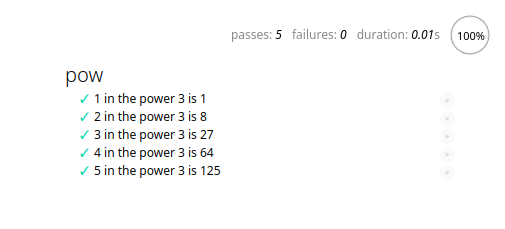

# Automated testing with Mocha

Automated testing will be used in further tasks, and it's also widely used in real projects.

## Why do we need tests?

When we write a function, we can usually imagine what it should do: which parameters give which results.

During development, we can check the function by running it and comparing the outcome with the expected one. For instance, we can do it in the console.

If something is wrong -- then we fix the code, run again, check the result -- and so on till it works.

But such manual "re-runs" are imperfect.

**When testing a code by manual re-runs, it's easy to miss something.**

For instance, we're creating a function `f`. Wrote some code, testing: `f(1)` works, but `f(2)` doesn't work. We fix the code and now `f(2)` works. Looks complete? But we forgot to re-test `f(1)`. That may lead to an error.

That's very typical. When we develop something, we keep a lot of possible use cases in mind. But it's hard to expect a programmer to check all of them manually after every change. So it becomes easy to fix one thing and break another one.

**Automated testing means that tests are written separately, in addition to the code. They run our functions in various ways and compare results with the expected.**

## Behavior Driven Development (BDD)

Let's start with a technique named [Behavior Driven Development](http://en.wikipedia.org/wiki/Behavior-driven_development) or, in short, BDD.

**BDD is three things in one: tests AND documentation AND examples.**

To understand BDD, we'll examine a practical case of development.

## Development of "pow": the spec

Let's say we want to make a function `pow(x, n)` that raises `x` to an integer power `n`. We assume that `n≥0`.

That task is just an example: there's the `**` operator in JavaScript that can do that, but here we concentrate on the development flow that can be applied to more complex tasks as well.

Before creating the code of `pow`, we can imagine what the function should do and describe it.

Such description is called a *specification* or, in short, a spec, and contains descriptions of use cases together with tests for them, like this:

```js
describe("pow", function() {

  it("raises to n-th power", function() {
    assert.equal(pow(2, 3), 8);
  });

});
```

A spec has three main building blocks that you can see above:

`describe("title", function() { ... })`
: What functionality we're describing? In our case we're describing the function `pow`. Used to group "workers" -- the `it` blocks.

`it("use case description", function() { ... })`
: In the title of `it` we *in a human-readable way* describe the particular use case, and the second argument is a function that tests it.

`assert.equal(value1, value2)`
: The code inside `it` block, if the implementation is correct, should execute without errors.

Functions `assert.*` are used to check whether `pow` works as expected. Right here we're using one of them -- `assert.equal`, it compares arguments and yields an error if they are not equal. Here it checks that the result of `pow(2, 3)` equals `8`. There are other types of comparisons and checks, that we'll add later.

The specification can be executed, and it will run the test specified in `it` block. We'll see that later.

## The development flow

The flow of development usually looks like this:

1. An initial spec is written, with tests for the most basic functionality.
2. An initial implementation is created.
3. To check whether it works, we run the testing framework [Mocha](https://mochajs.org/) (more details soon) that runs the spec. While the functionality is not complete, errors are displayed. We make corrections until everything works.
4. Now we have a working initial implementation with tests.
5. We add more use cases to the spec, probably not yet supported by the implementations. Tests start to fail.
6. Go to 3, update the implementation till tests give no errors.
7. Repeat steps 3-6 till the functionality is ready.

So, the development is *iterative*. We write the spec, implement it, make sure tests pass, then write more tests, make sure they work etc. At the end we have both a working implementation and tests for it.

Let's see this development flow in our practical case.

The first step is already complete: we have an initial spec for `pow`. Now, before making the implementation, let's use a few JavaScript libraries to run the tests, just to see that they are working (they will all fail).

## The spec in action

Here in the tutorial we'll be using the following JavaScript libraries for tests:

- [Mocha](https://mochajs.org/) -- the core framework: it provides common testing functions including `describe` and `it` and the main function that runs tests.
- [Chai](https://www.chaijs.com/) -- the library with many assertions. It allows to use a lot of different assertions, for now we need only `assert.equal`.
- [Sinon](https://sinonjs.org/) -- a library to spy over functions, emulate built-in functions and more, we'll need it much later.

These libraries are suitable for both in-browser and server-side testing. Here we'll consider the browser variant.

The full HTML page with these frameworks and `pow` spec:

```html
<!DOCTYPE html>
<html>
<head>
  <!-- add mocha css, to show results -->
  <link rel="stylesheet" href="https://cdnjs.cloudflare.com/ajax/libs/mocha/3.2.0/mocha.css">
  <!-- add mocha framework code -->
  <script src="https://cdnjs.cloudflare.com/ajax/libs/mocha/3.2.0/mocha.js"></script>
  <script>
    mocha.setup('bdd'); // minimal setup
  </script>
  <!-- add chai -->
  <script src="https://cdnjs.cloudflare.com/ajax/libs/chai/3.5.0/chai.js"></script>
  <script>
    // chai has a lot of stuff, let's make assert global
    let assert = chai.assert;
  </script>
</head>

<body>

  <script>
    function pow(x, n) {
      /* function code is to be written, empty now */
    }
  </script>

  <!-- the script with tests (describe, it...) -->
  <script src="test.js"></script>

  <!-- the element with id="mocha" will contain test results -->
  <div id="mocha"></div>

  <!-- run tests! -->
  <script>
    mocha.run();
  </script>
</body>

</html>
```

The page can be divided into five parts:

1. The `<head>` -- add third-party libraries and styles for tests.
2. The `<script>` with the function to test, in our case -- with the code for `pow`.
3. The tests -- in our case an external script `test.js` that has `describe("pow", ...)` from above.
4. The HTML element `<div id="mocha">` will be used by Mocha to output results.
5. The tests are started by the command `mocha.run()`.

The result:



As of now, the test fails, there's an error. That's logical: we have an empty function code in `pow`, so `pow(2,3)` returns `undefined` instead of `8`.

For the future, let's note that there are more high-level test-runners, like [karma](https://karma-runner.github.io/) and others, that make it easy to autorun many different tests.

## Initial implementation

Let's make a simple implementation of `pow`, for tests to pass:

```js
function pow(x, n) {
  return 8; // :) we cheat!
}
```

Wow, now it works!


## Improving the spec

What we've done is definitely a cheat. The function does not work: an attempt to calculate `pow(3,4)` would give an incorrect result, but tests pass.

...But the situation is quite typical, it happens in practice. Tests pass, but the function works wrong. Our spec is imperfect. We need to add more use cases to it.

Let's add one more test to check that `pow(3, 4) = 81`.

We can select one of two ways to organize the test here:

1. The first variant -- add one more `assert` into the same `it`:

    ```js
    describe("pow", function() {

      it("raises to n-th power", function() {
        assert.equal(pow(2, 3), 8);
    *!*
        assert.equal(pow(3, 4), 81);
    */!*
      });

    });
    ```
2. The second -- make two tests:

    ```js
    describe("pow", function() {

      it("2 raised to power 3 is 8", function() {
        assert.equal(pow(2, 3), 8);
      });

      it("3 raised to power 4 is 81", function() {
        assert.equal(pow(3, 4), 81);
      });

    });
    ```

The principal difference is that when `assert` triggers an error, the `it` block immediately terminates. So, in the first variant if the first `assert` fails, then we'll never see the result of the second `assert`.

Making tests separate is useful to get more information about what's going on, so the second variant is better.

And besides that, there's one more rule that's good to follow.

**One test checks one thing.**

If we look at the test and see two independent checks in it, it's better to split it into two simpler ones.

So let's continue with the second variant.

The result:



As we could expect, the second test failed. Sure, our function always returns `8`, while the `assert` expects `81`.

## Improving the implementation

Let's write something more real for tests to pass:

```js
function pow(x, n) {
  let result = 1;

  for (let i = 0; i < n; i++) {
    result *= x;
  }

  return result;
}
```

To be sure that the function works well, let's test it for more values. Instead of writing `it` blocks manually, we can generate them in `for`:

```js
describe("pow", function() {

  function makeTest(x) {
    let expected = x * x * x;
    it(`${x} in the power 3 is ${expected}`, function() {
      assert.equal(pow(x, 3), expected);
    });
  }

  for (let x = 1; x <= 5; x++) {
    makeTest(x);
  }

});
```

The result:



## Nested describe

We're going to add even more tests. But before that let's note that the helper function `makeTest` and `for` should be grouped together. We won't need `makeTest` in other tests, it's needed only in `for`: their common task is to check how `pow` raises into the given power.

Grouping is done with a nested `describe`:

```js
describe("pow", function() {

*!*
  describe("raises x to power 3", function() {
*/!*

    function makeTest(x) {
      let expected = x * x * x;
      it(`${x} in the power 3 is ${expected}`, function() {
        assert.equal(pow(x, 3), expected);
      });
    }

    for (let x = 1; x <= 5; x++) {
      makeTest(x);
    }

*!*
  });
*/!*

  // ... more tests to follow here, both describe and it can be added
});
```

The nested `describe` defines a new "subgroup" of tests. In the output we can see the titled indentation:


In the future we can add more `it` and `describe` on the top level with helper functions of their own, they won't see `makeTest`.

```smart header="`before/after` and `beforeEach/afterEach`"
We can setup `before/after` functions that execute before/after running tests, and also `beforeEach/afterEach` functions that execute before/after *every* `it`.```

For instance:

```js no-beautify
describe("test", function() {

  before(() => alert("Testing started – before all tests"));
  after(() => alert("Testing finished – after all tests"));

  beforeEach(() => alert("Before a test – enter a test"));
  afterEach(() => alert("After a test – exit a test"));

  it('test 1', () => alert(1));
  it('test 2', () => alert(2));

});
```

The running sequence will be:

```
Testing started – before all tests (before)
Before a test – enter a test (beforeEach)
1
After a test – exit a test   (afterEach)
Before a test – enter a test (beforeEach)
2
After a test – exit a test   (afterEach)
Testing finished – after all tests (after)
```


Please open the `beforeafter.view/index.html` file

Usually, `beforeEach/afterEach` and `before/after` are used to perform initialization, zero out counters or do something else between the tests (or test groups).


## Extending the spec

The basic functionality of `pow` is complete. The first iteration of the development is done. When we're done celebrating and drinking champagne -- let's go on and improve it.

As it was said, the function `pow(x, n)` is meant to work with positive integer values `n`.

To indicate a mathematical error, JavaScript functions usually return `NaN`. Let's do the same for invalid values of `n`.

Let's first add the behavior to the spec(!):

```js
describe("pow", function() {

  // ...

  it("for negative n the result is NaN", function() {
*!*
    assert.isNaN(pow(2, -1));
*/!*
  });

  it("for non-integer n the result is NaN", function() {
*!*
    assert.isNaN(pow(2, 1.5));    
*/!*
  });

});
```

The result with new tests:


The newly added tests fail, because our implementation does not support them. That's how BDD is done: first we write failing tests, and then make an implementation for them.

```smart header="Other assertions"
Please note the assertion `assert.isNaN`: it checks for `NaN`.

There are other assertions in [Chai](https://www.chaijs.com/) as well, for instance:

- `assert.equal(value1, value2)` -- checks the equality  `value1 == value2`.
- `assert.strictEqual(value1, value2)` -- checks the strict equality `value1 === value2`.
- `assert.notEqual`, `assert.notStrictEqual` -- inverse checks to the ones above.
- `assert.isTrue(value)` -- checks that `value === true`
- `assert.isFalse(value)` -- checks that `value === false`
- ...the full list is in the [docs](https://www.chaijs.com/api/assert/)
```

So we should add a couple of lines to `pow`:

```js
function pow(x, n) {
*!*
  if (n < 0) return NaN;
  if (Math.round(n) != n) return NaN;
*/!*

  let result = 1;

  for (let i = 0; i < n; i++) {
    result *= x;
  }

  return result;
}
```

Now it works, all tests pass:


## Summary

In BDD, the spec goes first, followed by implementation. At the end we have both the spec and the code.

The spec can be used in three ways:

1. As **Tests** - they guarantee that the code works correctly.
2. As **Docs** -- the titles of `describe` and `it` tell what the function does.
3. As **Examples** -- the tests are actually working examples showing how a function can be used.

With the spec, we can safely improve, change, even rewrite the function from scratch and make sure it still works right.

That's especially important in large projects when a function is used in many places. When we change such a function, there's just no way to manually check if every place that uses it still works right.

Without tests, people have two ways:

1. To perform the change, no matter what. And then our users meet bugs, as we probably fail to check something manually.
2. Or, if the punishment for errors is harsh, as there are no tests, people become afraid to modify such functions, and then the code becomes outdated, no one wants to get into it. Not good for development.

**Automatic testing helps to avoid these problems!**

If the project is covered with tests, there's just no such problem. After any changes, we can run tests and see a lot of checks made in a matter of seconds.

**Besides, a well-tested code has better architecture.**

Naturally, that's because auto-tested code is easier to modify and improve. But there's also another reason.

To write tests, the code should be organized in such a way that every function has a clearly described task, well-defined input and output. That means a good architecture from the beginning.

In real life that's sometimes not that easy. Sometimes it's difficult to write a spec before the actual code, because it's not yet clear how it should behave. But in general writing tests makes development faster and more stable.

Later in the tutorial you will meet many tasks with tests baked-in. So you'll see more practical examples.

Writing tests requires good JavaScript knowledge. But we're just starting to learn it. So, to settle down everything, as of now you're not required to write tests, but you should already be able to read them even if they are a little bit more complex than in this chapter.
